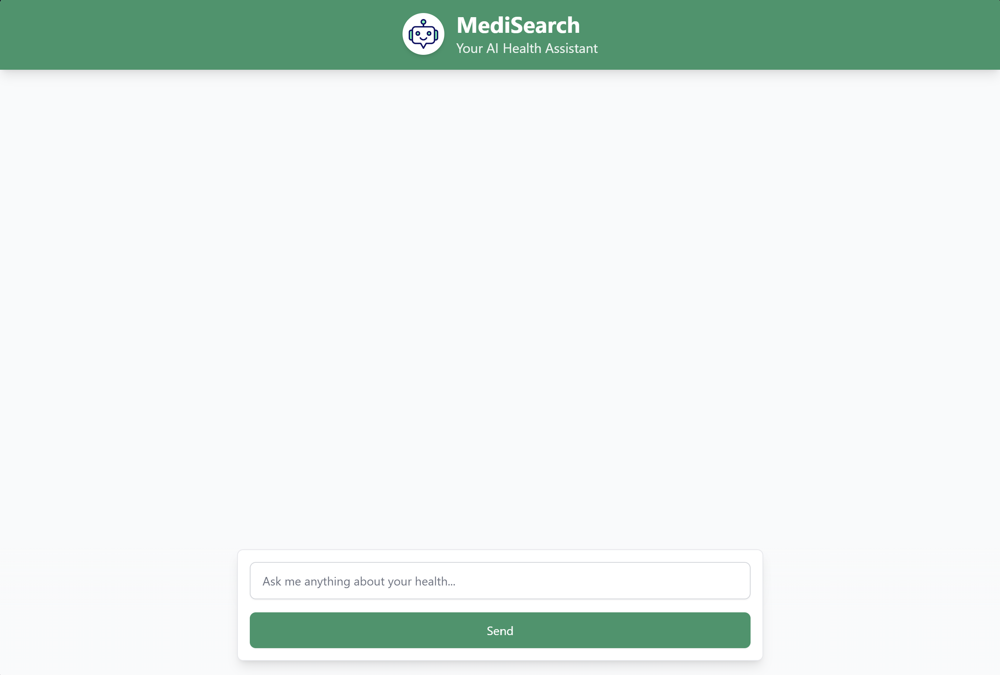

# MediSearch - AI Health Assistant

A modern web application that provides intelligent medical information assistance through a conversational interface. The application is built with security, reliability, and user experience in mind.



## Features
- Natural language medical query processing
- Structured responses with temporal context and key points
- Real-time chat-like interface
- Citation support for medical information
- Error handling and loading states
- Responsive design for all devices

## Tech Stack
### Frontend
- React.js with TypeScript
- Tailwind CSS for styling
- Axios for API requests
- Highlight.js for code syntax highlighting

### Backend
- Node.js with Express
- API key validation middleware
- Error handling middleware
- Environment-based configuration

## Setup
1. Clone the repository
    ```bash
    git clone https://github.com/Landrian61/MediSearch-Application.git
    ```

2. Install frontend dependencies
    ```bash
    cd client
    npm install
    ```

3. Install backend dependencies
    ```bash
    cd ../server
    npm install
    ```

4. In the server directory, copy the example environment file and add your API keys and configuration
    ```bash
    cp .env.example .env
    ```

    Update the `.env` file with the following:
    ```
    VEXT_API_KEY=bJhTy8y2.JYtslVG8Lf0r2dbGjaOpZCy5SOfT3bbT
    VEXT_BASE_URL=https://payload.vextapp.com/hook/FI501WHLMI/catch
    CHANNEL_TOKEN=brian
    PORT=5000
    ```

5. Start the backend (from the server directory)
    ```bash
    npm start
    ```

6. Start the frontend (from the client directory)
    ```bash
    npm start
    ```

## Project Structure
```
medisearch/
├── client/                 # Frontend React application
│   ├── src/
│   │   ├── components/    # React components
│   │   ├── services/      # API services
│   │   └── styles/        # CSS styles
│   └── public/            # Static assets
└── server/                # Backend Express application
    ├── middleware/        # Express middleware
    └── routes/            # API routes
```

## API Documentation
### POST /get-prompt-result
- Accepts medical queries
- Returns structured medical information
- Requires API key authentication

## Contributing
Please read `CONTRIBUTING.md` for details on our code of conduct and the process for submitting pull requests.
